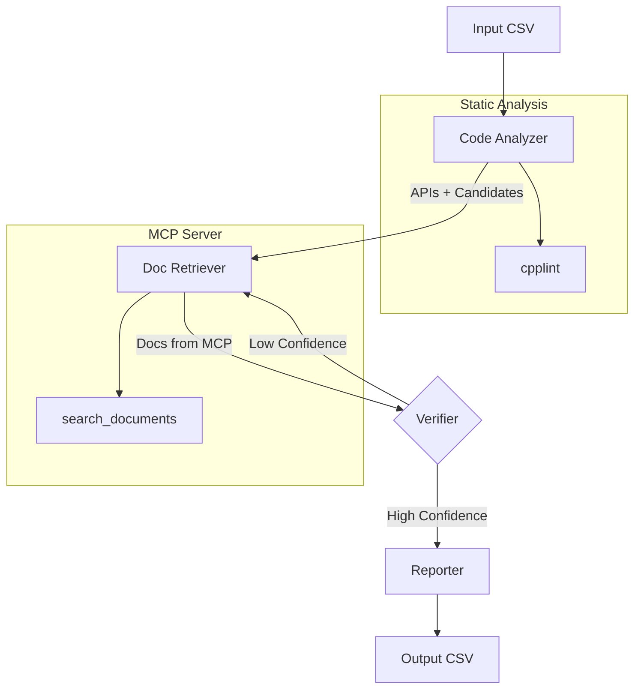

# BugHunter

Agentic C++ bug finder for RDI semiconductor test code using LangGraph, MCP, and Groq.

## Quick Start

```bash
# Install dependencies
pip install -r requirements.txt

# Set environment variables in .env
GROQ_API_KEY=your_api_key
MCP_SERVER_URL=http://localhost:8003/sse

# Run
python -m bughunter --input samples.csv --output results.csv
```

## Input Format

CSV with columns: `ID`, `Code`, `Context` (optional: `Correct Code`, `Explanation`)

## Output Format

CSV with columns: `ID`, `Bug Line`, `Explanation`

## Architecture



## Pipeline Nodes

| Node | Description |
|------|-------------|
| **Code Analyzer** | Extracts APIs, runs cpplint, identifies bug candidates via LLM |
| **Doc Retriever** | Queries MCP server for RDI documentation matching extracted APIs |
| **Verifier** | Cross-references code against docs; loops back if confidence is low |
| **Reporter** | Formats final bug line numbers and explanations |

## Requirements

- Python 3.11+
- Groq API key
- MCP server running with RDI documentation
